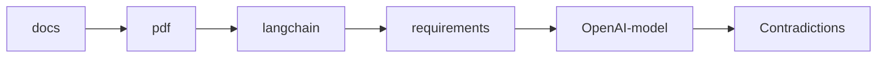

# Discovering inconsistencies: A deep dive with OpenAI models

Industry evolves fast. Clients discover new opportunities every week. Everyone's a startup.
You are a partner in achieving their goals.
Requirements and change-requests are coming in thick and fast.

With every adaptation, you wonder if it could contradict something you've already done.
With growth in clientele, there is no single person who understands all workflows.

Sounds familiar?

Numocity is a player in this field, making SaaS products for Electric Mobility providers.
Requirements evolve constantly, with each client in their own journey to find their business.

In the quest for a platform code-base, Numocity needs to prevent their requirements from turning into a multi-headed monster.

This project aims to catch inconsistencies early, when product-management authors new requirements.

## The automation

Here's the data-flow automation.

TODO: Explain the responsibilities of langchain and OpenAI-model

## Validation

OpenAI offers a range of models with [different pricing per token](https://openai.com/pricing)

Which model is good to detect inconsistencies in requirements?
The answer to this question needs a validation method. It presents the automation with pre-conceived contradictions of varying subtlety, expecting pre-ordained outputs.

TODO: List inputs of varying subtlety, with expected outputs in a table

## Usage

This is a langchain app that lets you chat with your PDF. It uses streamlit to present the conversation.

## Running

Steps to run:

1. `pip install -r requirements.txt`
2. To run the code use to command `streamlit run app.py`

## Conclusion

How did all the models fare against the pre-ordained inputs? Here's the report.

TODO: Tabulate the report

TODO: Add verdict: Which model is the best?
